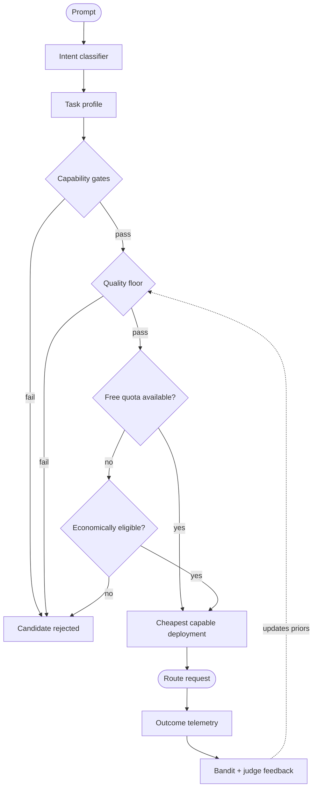

<div align="center">


**Find the cheapest capable model for every task. Prefer free. Pay only when necessary.**

**[Live docs & routing explainer →](https://zerocool909.github.io/mininfer-oss/)**

[](https://github.com/zerocool909/mininfer-oss/actions/workflows/ci.yml)
[](https://zerocool909.github.io/mininfer-oss/)
[](LICENSE)
[](pyproject.toml)
[](CONTRIBUTING.md)

</div>

min(Infer) is an open-source **model intelligence registry and economic constraint router**.

It continuously collects evidence from provider APIs, model catalogs, pricing pages, benchmark sources, and other public webpages; normalizes that evidence into a deployment registry; and uses task intent, hard capability constraints, quality thresholds, availability, quotas, and cost-per-success to select a model for each request.

The goal is simple:

**Don't ask "Which model is best?" Ask "Which model is capable enough for this task at the lowest effective cost?"**

|  |  |
| :-- | :-- |
| 🆓 **Free first** | Routes to free-tier deployments whenever they clear the task's bar, and pays only when they can't. |
| 🧾 **Evidence, not vibes** | Every price, quota and capability is a time-stamped record with source provenance. |
| 🎯 **Task-aware** | Hard capability gates and a quality floor — not one blended score. |
| 🔍 **Explainable** | Every decision names the winner *and* why each other candidate lost. |
| 🔒 **Your keys, your spend** | Runs on user-supplied credentials; prompt and response bodies are not stored by default. |

<details>
<summary><b>Table of contents</b></summary>

- [How a request is routed](#how-a-request-is-routed)
- [Built for agents](#built-for-agents)
- [Why min(Infer)?](#why-mininfer)
- [Core Principles](#core-principles)
- [Key Features](#key-features)
- [Quick Start](#quick-start)
- [CLI](#cli)
- [Reliability: reputation, backups, last resort](#reliability-reputation-backups-last-resort)
- [Running the Proxy](#running-the-proxy)
- [Arena Comparison](#arena-comparison)
- [Architecture](#architecture)
- [Repository Layout](#repository-layout)
- [Sources and Providers](#sources-and-providers)
- [Production Deployment](#production-deployment)
- [Security and Privacy](#security-and-privacy)
- [Evidence Provenance](#evidence-provenance)
- [What min(Infer) Is Not](#what-mininfer-is-not)
- [Roadmap](#roadmap)
- [Contributing](#contributing)
- [License](#license)

</details>

---

## How a request is routed



---

## Built for agents

An agent is mostly plumbing. Between the two steps that actually need judgement sit dozens that do not: expand a tool result, classify a branch, pull fields out of a page, choose the next action, format arguments, summarise what came back, retry a 429. Those calls are numerous, bounded and checkable — and sending every one of them to a frontier model is the default that makes an agent's bill scale with the number of **steps** rather than the difficulty of any one of them.

min(Infer) is the seam for that work. Point the whole agent at one OpenAI-compatible endpoint and let each step be routed on its own merits:

| Agent step | What it needs | Where it lands |
| :-- | :-- | :-- |
| Summarise a tool result | short output, no tools | the first free tier that clears |
| Extract fields into JSON | `structured` | the cheapest structured arm |
| Classify an intent or pick a branch | 4k context, prose out | a free tier |
| Choose the next action over a state blob | `tools`, 32k context | the cheapest tool-capable arm |
| Plan, decompose, or synthesise a hard answer | reasoning, 16k context | **the frontier arm — and only here** |

The frontier model is not removed — it is **reserved**. It stays in the pool and wins the calls that need it, while the calls that do not stop paying for it. Nothing is downgraded and no lesser endpoint appears: the **task** decides which model runs, not the caller.

**The free factor is the mechanism, and it is measured.** Free-tier deployments win whenever they clear the task's bar, and the router reads their quota headroom, so it steps to the next arm *before* the free one 429s. Ranking runs on cost per success, so a free model that fails half the time is priced as expensive as it is — what survives is what keeps completing the work. At agent scale that puts the bulk of the steps at zero marginal cost and keeps the paid tier for the few that earned it.

Every step names its author: the response carries the model and provider that answered, and the decision log keeps the shortlist and the rejection reasons. "Why is the agent spending this?" has a per-call answer, not a per-invoice one.

---

## Why min(Infer)?

The LLM ecosystem changes constantly.

Models are released, deprecated, repriced, rate-limited, moved between providers, exposed through new gateways, or temporarily offered through free tiers.

A model can also have very different economics depending on where it is served.

min(Infer) treats these as separate concerns:

```text
Model / Weights
      │
      ▼
Capabilities + Benchmarks
      │
      ▼
Deployment
(provider + endpoint + price + limits + latency + availability)
      │
      ▼
Task Constraints
      │
      ├── capable?
      ├── context sufficient?
      ├── modality supported?
      ├── quality floor met?
      ├── free quota available?
      ├── reliable enough?
      └── independent fallback available?
      │
      ▼
Cheapest Capable Deployment
```

This makes min(Infer) less of a traditional load balancer and more of a **model decision engine backed by continuously refreshed evidence**.

---

## Core Principles

### 1. Identity is separate from economics

A model's weights and a callable deployment are not the same thing.

For example:

```text
Artifact:
    Qwen / SomeModel

Deployments:
    Provider A → $0.10 / $0.40 per M tokens
    Provider B → $0.05 / $0.20 per M tokens
    Gateway C  → free tier with quota
    Local       → user's own infrastructure
```

The same model can therefore have different price, latency, availability, quota, context, quantization, and reliability characteristics depending on the deployment.

---

### 2. Free is a quota constraint

A deployment is not automatically "free" just because its price is currently `$0`.

min(Infer) distinguishes between:

```text
free_quota      recurring zero-price allowance
trial_credit    temporary promotional / trial balance
paid            normal paid usage
local           user-owned compute
unknown         economics not yet verified
```

A free deployment with exhausted quota is not economically equivalent to a genuinely available free deployment.

min(Infer) therefore tracks:

* request limits
* token limits
* quota windows
* observed `429` responses
* current headroom when available
* provider-specific usage signals
* trial / promotional expiration where known

---

### 3. Unknown is not false

Capability, pricing, quota, and availability can be:

```text
True
False
Unknown
```

Missing evidence should not automatically mean unsupported.

This prevents incomplete provider metadata from silently eliminating potentially useful deployments.

---

### 4. Fallbacks should be independent

Three model entries are not necessarily three independent options.

For example:

```text
OpenRouter
   └── Upstream Provider A
          └── Model X

Hugging Face
   └── Upstream Provider A
          └── Model X
```

Those are different gateways but potentially the same underlying failure domain.

min(Infer) therefore attempts to separate fallbacks across:

1. gateway/provider
2. upstream infrastructure
3. model family

The router reports the independence it actually achieved instead of assuming it.

---

### 5. Don't collapse everything into one score

min(Infer) deliberately avoids a simple weighted sum such as:

```text
quality * 0.5
+ cost * 0.3
+ latency * 0.2
```

Instead:

```text
1. Hard capability constraints
2. Minimum quality threshold
3. Economic eligibility
4. Reliability / quota constraints
5. Diversity constraints
6. Minimize effective cost per successful task
```

This prevents a very cheap but incapable model from winning simply because its price dominates the score.

---

## Key Features

### Economic Routing

Prioritizes available free-tier deployments when they satisfy the task constraints.

Falls back to paid deployments when free capacity is unavailable or when the task requires capabilities that the available free pool does not satisfy.

### Evidence-Driven Model Registry

min(Infer) ingests model and deployment evidence from:

* provider APIs
* public model catalogs
* pricing pages
* benchmark leaderboards
* performance endpoints
* arbitrary webpages

Fetched evidence is stored with source metadata and timestamps so routing decisions can be traced back to the information used to make them.

> Registry size is dynamic. An example cold-start snapshot currently contains approximately **23,799 deployments** and **200,000+ evidence records**. These numbers change as sources are refreshed.

### Prompt Intent Classification

Requests are mapped into task profiles such as:

```text
general_chat
summarise
code_generation
code_edit
hard_reasoning
sql_generation
structured_output
classification
vision
```

A fast heuristic classifier is used first, with optional model-based classification when confidence is insufficient.

### Prompt Complexity & Reasoning Estimation

Beyond task type, min(Infer) estimates prompt complexity to avoid over-spending on reasoning-class models (e.g. o1/R1/Claude Thinking) for simple prompts, while ensuring complex multi-step reasoning tasks receive capable models:

* **Tier 1 (Zero-Latency Heuristics):** Analyzes mathematical proofs, multi-step logic, code debugging, and constraint counts, counterbalanced by negative attenuation signals (e.g., simple extraction, translation, formatting, or summarization).
* **Tier 2 (Optional LLM Judge):** For prompts with ambiguous signals near classification thresholds, an optional small model can adjudicate reasoning necessity with JSON-enforced rubric outputs.
* **Probe-and-Escalate:** If a low-complexity model selected for an inexpensive route fails runtime validation (`empty_content` or `bad_output`), min(Infer) automatically re-routes with reasoning requirements enabled and retries against a higher-capability model.

### Conservative Quality Estimation

min(Infer) combines benchmark evidence with observed outcomes.

The router uses a conservative lower-bound estimate rather than allowing a small number of lucky successful requests to immediately promote an untested deployment.

Where Wilson-based estimation is used, observed evidence and benchmark priors are kept explicit rather than treating an untested model as either perfect or useless.

### Reliability-Aware Fallbacks

min(Infer) records:

* latency
* timeouts
* errors
* HTTP `429`
* availability
* throughput
* provider-level failures

This allows routing decisions to account for more than nominal token price.

### Contextual Bandit

Optional Thompson-sampling exploration allows min(Infer) to learn which deployments perform well for specific task families.

The bandit can incorporate:

* successful outcomes
* failed outcomes
* latency
* quota failures
* human preference feedback

Human preference can be submitted through the Arena interface.

### OpenAI-Compatible Proxy

min(Infer) exposes an OpenAI-compatible endpoint:

```text
POST /v1/chat/completions
```

Applications can request:

```json
{
  "model": "auto"
}
```

and let min(Infer) select the deployment dynamically.

### Arena Compare Mode

Multiple eligible deployments can be executed concurrently for comparison.

The Playground can display:

* response quality
* latency
* generation speed
* estimated cost
* selected deployment
* routing rationale

Human selection can then be fed back into the routing system.

### LLM-as-judge, batched

Untried models gain evidence automatically. A background *shadow request* replays
your prompt against free arms that have little history, then judges the answers
against the one the caller actually got — so an arm earns or loses its place
without you paying for it.

The judging is **batched**: several candidates are compared in a **single** model
call rather than one call each.

```
one judge call:
  CANDIDATE A: PASS - correct and complete
  CANDIDATE B: FAIL - ignores the second question
  CANDIDATE C: PASS - correct but terse
  BEST: A
```

Two reasons it is one call. Cost and latency are linear in the number of
candidates when each is judged separately, and every call re-reads the same
prompt. More importantly, *"which of these is best?"* is a more consistent
question than *"is this good?"* asked k times — the candidates are compared
against each other instead of against a bar each call invents separately.

The verdict per candidate becomes an observation (`signal_kind=judge_trial`), and
the winner is recorded, so "which model performed best" is answerable afterwards.
Cheap heuristics run first — empty output, a provider error returned as text, a
repetition loop — so a candidate that obviously failed never costs a judge call.
A judge that errors or answers unparseably is **not** treated as evidence against
the model: the candidate keeps its heuristic verdict.

Tune it in `config/policy.yaml`:

| Key | Default | Meaning |
|---|---|---|
| `free_trial_obs` | `3` | how many observations a free arm keeps its trial exemption for |
| `judge_batch_size` | `3` | how many untried arms one shadow request trials and judges together |

### Explainable Routing

Every routing decision can be inspected.

The router exposes:

```text
selected model
task classification
candidate models
rejection reasons
quality evidence
cost assumptions
quota state
fallback separation
policy used
```

Responses may include explainability headers such as:

```text
X-MI-Deploy
X-MI-Task
X-MI-Policy
X-MI-Candidates
```

---

# Quick Start

## 0. Prerequisites &mdash; do these first

Every line below is **required** for the features to work end to end. Skipping
one is a known failure mode (see the table at the end).

| Requirement | Version | Why |
|---|---|---|
| Python | **3.11+** | `@dataclass(slots=True)`; 3.9/3.10 crash at import |
| Node.js + npm | 20+ | builds the dashboard into `web/dist` (skip with Docker) |
| Docker *(optional)* | &mdash; | the image builds the SPA and pins deps |

**POSIX (bash)**

```bash
git clone https://github.com/zerocool909/mininfer-oss.git && cd mininfer-oss
python3 -m venv .venv && source .venv/bin/activate
pip install -e '.[server,agents]'   # server = proxy/dashboard · agents = mi scout / add-url
cp .env.example .env                # REQUIRED: read at startup, and bind-mounted by compose
npm --prefix web install && npm --prefix web run build   # REQUIRED for the React dashboard
```

**Windows (PowerShell)**

```powershell
git clone https://github.com/zerocool909/mininfer-oss.git; cd mininfer-oss
python -m venv .venv; .\.venv\Scripts\Activate.ps1
pip install -e ".[server,agents]"
Copy-Item .env.example .env
npm --prefix web install; npm --prefix web run build
# or just: .\run.cmd   (it does all of the above, idempotently, then runs `mi proxy`)
```

> Use `python -m mininfer ...` or activate the venv. `mi` lives in
> `.venv/Scripts` and is **not** on `PATH` otherwise.

### Mandatory `.env` values

```ini
OPENROUTER_API_KEY=...   # or GROQ_API_KEY / GEMINI_API_KEY / … — at least ONE model provider key
TINYFISH_API_KEY=...     # web search: the scout's research and chat grounding
MI_CHAT_SEARCH=auto      # ground time-sensitive chat answers instead of guessing
MI_AGENT_MODELS=...      # free-first agent chain (optional; ships a sensible default)
MI_LAST_RESORT=...       # reserved arm, so a request always gets an answer
```

`.env` is read **at startup** — restart the proxy after editing it. There is no
key-less path to inference: with no provider key the proxy returns `503
no_api_key`.

### First run, in order

```bash
mi ingest        # pull provider catalogues
mi resolve       # merge model identities across sources
mi quota seed    # free-tier limits for the quota card
mi scout         # research each free model (needs [agents] + TINYFISH_API_KEY)
mi proxy         # http://127.0.0.1:8765/
```

### Verify (all should pass)

```bash
mi doctor                                # every mandatory check, with the fix for each failure
curl -s localhost:8765/healthz           # {"ok": true}
curl -s localhost:8765/v1/models | head  # a catalogue, not an error
mi recommend summarise                   # 2-3 primaries + 2 backups (+ last resort)
mi reputation                            # per-provider/model verdicts
```

Open `http://127.0.0.1:8765/` → the React dashboard, and a populated **Free models** tab.

### Troubleshooting

| Symptom | Cause | Fix |
|---|---|---|
| `dataclass() got an unexpected keyword argument 'slots'` | Python < 3.11 (e.g. Anaconda base) | activate `.venv`, or `conda deactivate` |
| `'mi' is not recognized` | venv not active | activate it, or call `.venv/Scripts/mi` |
| Dashboard looks old / plain HTML | `web/dist` not built | `npm --prefix web run build` |
| `WARNING: /app/.env is a DIRECTORY` | compose made a dir for a missing file | `rmdir .env && cp .env.example .env` |
| `503 no_api_key` / `0 eligible` | no model provider key | set `OPENROUTER_API_KEY` or another |
| `mi scout`: "agent runtime is not installed" | `[agents]` extra missing | `pip install -e '.[agents]'` |
| Scout dossiers have no sources | `TINYFISH_API_KEY` unset (the scout is TinyFish-only) | set it; otherwise dossiers are facts-only |
| A grounded answer cites generic Wikipedia pages (e.g. *Mumbai*, *Gujarat* for a weather query) | chat search used `auto`, and Wikipedia answered first, so the fresher tiers were never reached | it now prefers TinyFish; set `TINYFISH_API_KEY`, or `MI_CHAT_SEARCH_PROVIDER=tinyfish` |
| HTTP 402 from search | TinyFish daily free allowance used | wait for 00:00 UTC, or add credit |
| A provider keeps 429ing | free-tier rate limit | the fallback chain + last resort cover it; `mi reputation` names it |
| A compare/shortlist includes a model that can't answer (safety, TTS, music) | it predates the special-purpose gate, or the task opted in | `mi explain TASK` shows `unsupported: … model`; drop `allow_roles` or update |
| `port 8765 already in use` | another process | `mi proxy --port 8766` |

Deep detail — schema, algorithms, every tunable — is in [`appendix.md`](appendix.md).

---

## 1. Install

```bash
git clone https://github.com/zerocool909/mininfer-oss.git
cd mininfer-oss

python3 -m venv .venv
source .venv/bin/activate

# Base install: registry, ingest, routing and the CLI (`mi`).
pip install -e .

# To also run the OpenAI-compatible proxy / dashboard, add the server extra.
# Without it, `mi proxy` exits with a message telling you exactly this.
pip install -e '.[server]'
```

---

## 2. Build the registry

Ingest public sources:

```bash
python3 -m mininfer ingest
```

Resolve model identities across sources:

```bash
python3 -m mininfer resolve
```

Declare the free-tier quota limits, so the router's free-first policy and the
dashboard's **Quota headroom** card have something to read:

```bash
python3 -m mininfer quota seed
```

Inspect the registry:

```bash
python3 -m mininfer stats
```

---

## 3. Test routing

> **You need one provider key before anything routes.** The catalogue builds with
> no credentials — that is what Tier 0 is for — but no provider serves inference
> without one, so `mi route` reports `0 eligible` until a key is exported. This is
> the design, not a fault: min(Infer) never needs *your* key, it needs *a* key.
>
> Groq has the fastest free tier to obtain (<https://console.groq.com/keys>):
>
> ```bash
> export GROQ_API_KEY="gsk_..."
> mi route general_chat       # 1774 deployments -> 264 eligible -> 3 selected
> ```
>
> Any provider in `mi sources` works, and a key also widens the catalogue on the
> next `mi ingest` — the router only ranks what it can actually call.

Route a task:

```bash
python3 -m mininfer route general_chat
```

Inspect why deployments were selected or rejected:

```bash
python3 -m mininfer explain code_edit
```

Or use the CLI entrypoint:

```bash
mi ingest
mi route general_chat

# Estimate prompt complexity and reasoning need
mi complexity "Prove by induction that sum(i^2) = n(n+1)(2n+1)/6"

# Route adaptively based on prompt complexity
mi route general_chat --prompt "Prove by induction that sum(i^2) = n(n+1)(2n+1)/6"

# Inspect decision stats and escalations across past traffic
mi complexity --report
```

---

## Example Routing Output

Example output from one registry snapshot:

```text
FUNNEL
23799 deployments
        ↓
97 eligible
        ↓
42 currently classified as zero-marginal-cost
        ↓
14 distinct upstreams

Rejected:
  0 unsupported
  0 unverified
  206 below quality floor
  927 without benchmark coverage

DIVERSITY
Gateway + upstream separation achieved

1st candidate:
  openrouter:xiaomi/mimo-v2.6-pro

  price:
    $0.435 / M input
    $0.870 / M output

  estimated success:
    0.70 conservative lower bound

  prior:
    0.88 from benchmark evidence

  availability:
    1.00 observed

  observed 429 rate:
    0%

  estimated cost per success:
    $0.0019
```

> The exact numbers above are an example snapshot, not a permanent benchmark or guarantee.

---

# CLI

| Command                    | Purpose                                                 |
| -------------------------- | ------------------------------------------------------- |
| `mi sources`               | Show configured sources and authentication requirements |
| `mi ingest [src…]`         | Fetch and snapshot source evidence                      |
| `mi resolve`               | Resolve model/deployment identities across sources      |
| `mi stats`                 | Show registry and provider statistics                   |
| `mi route TASK`            | Resolve the best eligible deployments for a task        |
| `mi explain TASK`          | Explain ranking and rejection reasons                   |
| `mi observe`               | Record inference outcomes                               |
| `mi quota seed`            | Seed declared quota configuration                       |
| `mi quota show`            | Inspect configured and observed quota state             |
| `mi bench FAMILY`          | Run RouterBench evaluations                             |
| `mi bandit TASK`           | Inspect contextual-bandit posteriors                    |
| `mi leaderboards [SUBSTR]` | Compare ingested benchmark sources                      |
| `mi metrics`               | Enrich deployments with performance metrics             |
| `mi add-url URL`           | Ingest evidence from an arbitrary webpage               |
| `mi scout`                 | Agentic form guide: write a dossier for every free model (needs `[agents]`) |
| `mi dossiers [SUBSTR]`     | Print the model form guide — what each free arm is for  |
| `mi dossier-report`        | Calibrate the dossier routing prior from decisions + outcomes |
| `mi doctor`                | Check the mandatory setup; prints the fix for each failure |
| `mi reputation [--task T] [--days D]` | Provider/model outcome verdicts — 429s, timeouts, health |
| `mi recommend TASK`        | 2–3 primary arms for a task + 2 backups (≥1 untested) |
| `mi refresh`               | Re-ingest every available source and re-derive (the cron target) |
| `mi proxy`                 | Start the OpenAI-compatible routing proxy               |

---

# Reliability: reputation, backups, last resort

Every request is recorded whatever the outcome, so **which arms fail — and how —
is learnable**. Three pieces build on that log:

- **`mi reputation [--task T] [--days D]`** rolls outcomes up per
  `(provider, model, task)` and gives a verdict — `healthy`, `degraded`,
  `retire` — gated on a **minimum sample**, so one 429 never condemns an arm. A
  429/timeout is attributed at the **provider** level too: an outage behind a
  gateway demotes that gateway rather than being rediscovered arm by arm.
- **`mi recommend TASK`** (also `GET /v1/recommend`) returns **2–3 primary arms
  plus 2 backups**, distinct by gateway/upstream, with one backup slot reserved
  for an **untested** arm — so the router keeps learning instead of re-using the
  same winner until its quota dies.
- **A reserved last resort.** Set `last_resort: <deploy_id>` in
  `config/policy.yaml` (or `MI_LAST_RESORT`). It is never ranked and never
  displaces a cheaper arm; it is tried only after the chain is exhausted, so a
  request can run out of free arms but not out of an answer.

**A probe failure is not a provider outage.** Only a revoked key (`auth_error`)
or a hard `401`/`403` removes a provider from the pool; a `network_error` or
`tls_error` is *our own* connectivity and is retried, not punished. Excluding on
it once blackholed every provider at the same time — one probe without a network
marked groq and openrouter unhealthy together, leaving zero eligible arms.

**Right model, right job.** Every task defaults to general-purpose text
generators. A special-purpose model — a safety/moderation classifier, an
embedding or rerank model, ASR/TTS, an image or music generator — is rejected by
the hard filter even when it is free and untested, because a task requiring no
capability would otherwise admit one and exploration would then pick it (a music
model, a TTS voice and a content classifier were all served for prose). A task
that genuinely wants a role opts in with `allow_roles: [safety]` in
`config/policy.yaml`.

**No model becomes the default.** The router caps any single arm at
`max_model_share_pct` (60%) of a task's traffic, the dossier/anonymity priors are
bounded, and the agents (`mi scout`, `mi add-url`, `mi resolve --adjudicate`)
run on a **free-first chain that rotates** across arms instead of pinning to
whichever answered last — otherwise one free tier is exhausted while the others
sit idle. Set the chain with `MI_AGENT_MODELS`; see the appendix.

For the deep version — evidence confidence rungs, the merge guard, the dossier
prior, the full reputation schema — see [`appendix.md`](appendix.md).

---

# Running the Proxy

Requires the `server` extra (`pip install -e '.[server]'`).

Set API keys only for providers you intend to use:

```bash
export OPENROUTER_API_KEY="..."
export GROQ_API_KEY="..."
export GEMINI_API_KEY="..."
```

Start min(Infer):

```bash
mi proxy --port 8765
```

Open:

```text
http://127.0.0.1:8765/
```

The dashboard includes:

* registry statistics
* routing funnel
* quota information
* recent routing decisions
* task classification
* Playground
* Arena Compare
* routing explanations

## Bring your own keys

min(Infer) never needs to hold a provider key. There are two ways to supply one,
and they compose:

**Operator keys (environment).** Set any provider's variable and that provider
becomes callable for every request:

```bash
export OPENROUTER_API_KEY="..."
export GROQ_API_KEY="..."
```

**Caller keys (per request).** A caller can send their own key, which is used for
that request only and never stored server-side:

```bash
curl http://127.0.0.1:8765/v1/chat/completions \
  -H 'Content-Type: application/json' \
  -H 'X-User-API-Keys: {"openrouter":"sk-or-..."}' \
  -d '{"model":"auto","messages":[{"role":"user","content":"hi"}]}'
```

The dashboard's **Providers** tab does this for you: keys you type there live in
your browser's `localStorage` and are forwarded on each call. On a shared or
public deployment that is the point — the operator holds no credentials and pays
for nothing.

A configured key also **widens the catalogue**: `mi ingest` (and `mi refresh`)
now fetch every source whose key is present, so the providers you brought appear
in routing instead of only being callable.

## Keeping the catalogue current

Prices change, free tiers end, and a registry that still says "free" after a
provider started charging is worse than an empty one — the router keeps choosing
that arm and every request quietly costs money. One command re-reads everything
and re-derives the registry:

```bash
mi refresh          # verify -> reconcile -> metrics, in that order
```

* **verify** re-fetches every available source and reports what changed price or
  free status (it never trusts the 6-hour raw cache — a cache cannot verify);
* **reconcile** re-derives each deployment's canonical price from the new
  evidence, cross-checked against a market median across independent sources;
* **metrics** folds provider throughput / latency into the registry.

Run it by hand, or on a schedule. Either:

```bash
# a plain cron entry — nightly at 03:00, logging to a file
0 3 * * * cd /path/to/mininfer && mi refresh >> /tmp/mininfer-refresh.log 2>&1
```

```bash
# or the container's built-in job (refreshes nightly, writes /data/verify.json)
docker compose --profile jobs up -d
```

The registry is always **re-derivable**: every upstream payload is snapshotted to
`raw/<source>/<date>/<sha>.json` before it is parsed, so a corrected parser is a
re-run of `mi refresh`, not a data migration. (`raw/` is a local stand-in for an
R2/S3 bucket — see `mininfer/fetch.py`.)

## Exposing the API beyond localhost

`mi proxy` binds `127.0.0.1` by default, so nothing is reachable off your
machine until you say so. To let other machines or agents use it, tunnel it:

```bash
cloudflared tunnel --url http://127.0.0.1:8765     # or: ngrok http 8765
```

or bind all interfaces directly (only behind your own firewall/TLS):

```bash
mi proxy --host 0.0.0.0 --port 8000
```

**Before you expose it, turn on access control.** With nothing configured the
proxy is open — the dashboard, the registry, and `/v1/search` (which spends
money) are all reachable:

```bash
export MI_API_KEYS="$(openssl rand -hex 24):me"   # who may call; tenant key
export MI_ADMIN_TOKEN="$(openssl rand -hex 32)"    # the dashboard / stats / plan surface
export MI_RATE_LIMIT_RPM=120                       # per tenant
export MI_MAX_BODY_BYTES=1048576                   # 1 MiB
```

With **caller keys** the operator holds no provider credentials, so a public
instance does not put your spend at risk — each caller pays with their own key.
You still want `MI_API_KEYS` (an invite gate) and the rate/body caps (abuse
protection). TLS terminates at the tunnel, and the caller's key travels in a
request header, so always expose over `https://`.

If you would rather not run anything, `deploy/modal/app.py` hosts the same code
on Modal (it needs a Postgres, because serverless containers have no persistent
local disk — see below).

## Storage: SQLite by default, Postgres only to scale

`MI_DB` accepts a path **or** a DSN, and that is the only switch:

| `MI_DB` | Engine | Replicas |
|---|---|---|
| `mininfer.db` (default) | SQLite | **1** — every request writes, and SQLite is single-writer |
| `postgresql://user:pw@host/db` | Postgres | as many as you like |

For a local tool — one process, one operator — **SQLite is enough, and it is the
default.** Postgres exists for one reason and it is not correctness: every
request appends a decision plus an observation per attempt, and a single SQLite
file cannot take that from several processes at once. So reach for Postgres only
when you run more than one replica, or a serverless host with no persistent disk.
`deploy/local/docker-compose.postgres.yml` runs that shape on a laptop if you
want to try it.

---

# Using min(Infer) with OpenAI Clients

## Python

```python
from openai import OpenAI

client = OpenAI(
    base_url="http://127.0.0.1:8765/v1",
    api_key="not-needed",
)

response = client.chat.completions.create(
    model="auto",
    messages=[
        {
            "role": "user",
            "content": "Write an async connection pool in Python."
        }
    ],
)

print(response.choices[0].message.content)
```

You can also explicitly select a task profile:

```python
model="code_edit"
model="hard_reasoning"
model="sql_generation"
```

---

## TypeScript / Vercel AI SDK

```typescript
import { createOpenAI } from "@ai-sdk/openai";
import { generateText } from "ai";

const mininfer = createOpenAI({
  baseURL: "http://127.0.0.1:8765/v1",
  apiKey: "not-needed",
});

const { text } = await generateText({
  model: mininfer("auto"),
  prompt: "Explain optimistic vs pessimistic locking in distributed databases.",
});

console.log(text);
```

---

## cURL

```bash
curl http://127.0.0.1:8765/v1/chat/completions \
  -H "Content-Type: application/json" \
  -d '{
    "model": "auto",
    "messages": [
      {
        "role": "user",
        "content": "How do distributed hash tables work?"
      }
    ]
  }'
```

---

# Arena Comparison

Run multiple candidates for the same task:

```bash
curl http://127.0.0.1:8765/v1/chat/completions \
  -H "Content-Type: application/json" \
  -d '{
    "model": "auto",
    "mi_options": 2,
    "stream": true,
    "messages": [
      {
        "role": "user",
        "content": "Compare Raft vs Paxos in simple terms."
      }
    ]
  }'
```

The Playground can compare the responses and submit a human preference.

Human feedback can then update the routing policy and bandit state.

---

# Architecture

```text
                    ┌────────────────────────────┐
                    │       Evidence Sources     │
                    │                            │
                    │ APIs / Catalogs / Pricing  │
                    │ Benchmarks / Webpages      │
                    └─────────────┬──────────────┘
                                  │
                                  ▼
                    ┌────────────────────────────┐
                    │        Ingestion Layer     │
                    │                            │
                    │ adapters + snapshots       │
                    └─────────────┬──────────────┘
                                  │
                                  ▼
                    ┌────────────────────────────┐
                    │       Evidence Store       │
                    │                            │
                    │ source / timestamp / hash  │
                    │ confidence / provenance     │
                    └─────────────┬──────────────┘
                                  │
                                  ▼
                    ┌────────────────────────────┐
                    │    Identity Resolution     │
                    │                            │
                    │ artifact ↔ deployment      │
                    └─────────────┬──────────────┘
                                  │
                                  ▼
                    ┌────────────────────────────┐
                    │   Deployment Registry      │
                    │                            │
                    │ capability / price / quota │
                    │ latency / uptime / context │
                    └─────────────┬──────────────┘
                                  │
                       user prompt│
                                  ▼
                    ┌────────────────────────────┐
                    │      Intent Classifier     │
                    └─────────────┬──────────────┘
                                  │
                                  ▼
                    ┌────────────────────────────┐
                    │       Routing Policy       │
                    │                            │
                    │ capabilities               │
                    │ quality floor              │
                    │ quota                      │
                    │ economics                  │
                    │ reliability                │
                    │ fallback diversity         │
                    └─────────────┬──────────────┘
                                  │
                                  ▼
                    ┌────────────────────────────┐
                    │        Model Router        │
                    │                            │
                    │ cheapest capable candidate │
                    └─────────────┬──────────────┘
                                  │
                ┌─────────────────┼─────────────────┐
                ▼                 ▼                 ▼
             Gateway A         Gateway B         Local
             Provider X        Provider Y        vLLM/Ollama
                │                 │                 │
                └─────────────────┼─────────────────┘
                                  ▼
                           Outcome Telemetry
                                  │
                                  ▼
                         Bandit / Feedback
```

---

# Repository Layout

Two documents are part of the contract rather than the prose:

* [`docs/api-contract.md`](docs/api-contract.md) — which endpoints are stable,
  which are experimental, and the deprecation policy. Its endpoint inventory is
  parsed by `tests/test_api_contract.py`, so it cannot drift from the code.
* [`docs/RELEASING.md`](docs/RELEASING.md) — the release checklist.


```text
mininfer/

├── proxy.py
├── router.py
├── store.py
├── schema.py
├── intent.py
├── execute.py
├── quota.py
├── bandit.py
├── resolve.py
├── ingest.py
├── bench.py
├── fetch.py
│
├── web/
│   ├── legacy.py
│   └── dist/
│
config/
├── policy.yaml
├── quotas.yaml
└── profiles/
    ├── local.env          # the local variant, as declared state
    └── cloud.env          # the cloud variant

deploy/
├── local/                 # docker-compose.yml + README
├── cloud/                 # fly.toml, k8s.yaml, litestream.yml, keys.example.json
└── README.md              # which variant, and why profiles and not forks

docker/
└── entrypoint.sh

Dockerfile                 # one image, used by both variants
docker-compose.yml         # `include:` shim -> deploy/local/

web/
└── React / TypeScript / Vite application
```

---

# Sources and Providers

min(Infer) is designed to ingest information from multiple classes of sources.

### Public catalogs and gateways

Examples include:

* OpenRouter
* Hugging Face Inference Providers
* Vercel AI Gateway
* DeepInfra
* Featherless
* Chutes
* Novita
* SambaNova
* NVIDIA NIM

### Direct inference providers

Examples include:

* Groq
* Google Gemini
* Cerebras
* Mistral
* GitHub Models
* Cloudflare Workers AI
* Cohere
* Together AI
* Nebius
* Hyperbolic
* Fireworks AI
* Zhipu
* Moonshot
* DashScope

### Local runtimes

* Ollama
* vLLM
* LM Studio

Provider pricing, quotas, model availability, and free-tier policies can change. min(Infer) therefore treats provider information as **time-stamped evidence**, not immutable truth.

Run:

```bash
mi sources
```

to inspect the current configured source state.

---

# Production Deployment

min(Infer) can run as a containerized service with the API and web application packaged together.

```bash
docker compose up -d
```

Health check:

```bash
curl http://localhost:8765/healthz
```

Deployment examples are documented in [`deploy/README.md`](deploy/README.md).

---

# Security and Privacy

min(Infer) is designed to run with user-owned provider credentials.

### Important

Do not commit API keys, credentials, provider tokens, or private configuration to the repository.

Do not enable unrestricted public inference against your own provider accounts.

For publicly hosted deployments, use one or more of:

* user-provided API keys
* authenticated access
* strict request quotas
* an allowlisted free-only provider pool
* hard spend limits
* disabled paid fallback
* per-user rate limiting

Inference telemetry should avoid storing raw prompts and responses by default.

---

# Evidence Provenance

Evidence should be traceable.

A deployment record should make it possible to answer:

```text
Where did this price come from?
When was it observed?
Which source reported it?
How confident are we?
Has the evidence expired?
What changed since the previous snapshot?
```

Raw webpage snapshots should not automatically be redistributed without checking the source's licensing and terms.

For public releases, prefer publishing:

* normalized metadata
* source URLs
* timestamps
* hashes
* derived facts
* compact provenance records

rather than blindly committing large bodies of third-party webpage content.

---

# What min(Infer) Is Not

min(Infer) is not:

* a benchmark leaderboard
* a universal "best model" ranking
* a replacement for every AI gateway
* a guarantee that free inference is always available
* a way to bypass provider rate limits
* a mechanism for circumventing provider terms or quotas

Its purpose is to make **model selection an explicit, evidence-backed engineering decision**.

---

# Roadmap

### Phase 1 — Foundation

* [x] Multi-source ingestion
* [x] Deployment registry
* [x] Identity resolution
* [x] Capability filtering
* [x] Economic routing
* [x] OpenAI-compatible proxy
* [x] Explainability
* [x] Quota tracking
* [x] Arena comparison

### Phase 2 — Learning

* [x] Thompson-sampling exploration
* [x] Human feedback
* [ ] Automated outcome graders
* [ ] Task-specific success models
* [ ] Better uncertainty calibration

### Phase 3 — Model Intelligence

* [ ] Automated benchmark ingestion
* [ ] Benchmark freshness tracking
* [ ] Provider reliability scoring
* [ ] Change detection for pricing and quotas
* [ ] Model deprecation detection
* [ ] Capability conflict detection

### Phase 4 — Ecosystem

* [ ] Public registry snapshots
* [ ] Reproducible RouterBench suite
* [ ] Community provider adapters
* [ ] Hosted registry explorer
* [ ] Hosted routing playground
* [ ] Model-routing research reports

---

# Contributing

The most useful contributions are provider adapters, benchmark adapters, routing policies, evaluation datasets, bug fixes, documentation, and reproducible experiments.

See:

```text
CONTRIBUTING.md
CODE_OF_CONDUCT.md
SECURITY.md
```

---

# License

MIT

---

<p align="center">
  <sub>If min(Infer) saves you money, a ⭐ helps other people find it.</sub>
</p>
