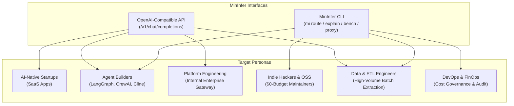
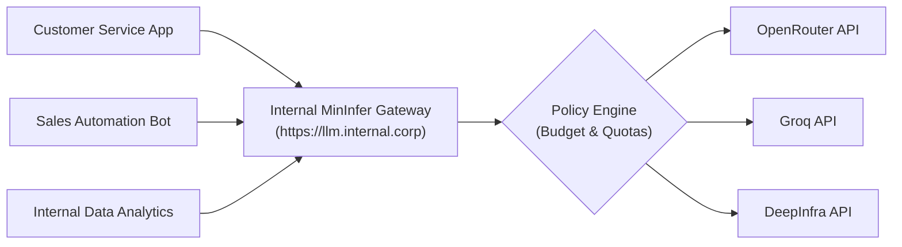

# MinInfer in the Real World: A Multi-Persona Case Study & Impact Analysis

*How Dynamic Economic Routing Slashes 70–90% of LLM Costs and Eliminates Outages via API & CLI*

---

## Executive Summary

As large language models become foundational infrastructure across software applications, organizations face two existential operational hurdles:

1. **The Flagship Margin Trap**: Over 80% of application prompts (data extraction, summarization, tool formatting, classification, chat, and simple code edits) are routed by default to premium frontier models ($5.00 – $30.00 / Mtok). A sub-cent or zero-cost model would yield identical functional accuracy.
2. **Gateway Fragility & Rate-Limit Chokepoints**: When a centralized gateway suffers an outage, rate limit (HTTP 429), or latency spike, dependent services crash without intelligent, cross-provider failover.

**MinInfer** is a constraint-first, score-second dynamic routing engine that solves both problems. Guided by the principle **"Free first. Pay only when free isn't good enough,"** MinInfer routes every prompt to the cheapest capable deployment where capability, latency, and cost are continuously measured, not assumed.

Available as both a **drop-in OpenAI-compatible API** and a **high-leverage developer CLI**, MinInfer serves diverse personas across the modern AI engineering ecosystem. This case study analyzes six real-world scenarios demonstrating who MinInfer is useful for, how it is integrated, and the quantifiable outcomes achieved.

---

## Architectural Modalities: API vs. CLI

MinInfer is engineered with dual interfaces to fit seamlessly into any developer workflow or production pipeline:



| Dimension | OpenAI-Compatible API (`mi proxy`) | Developer & Pipeline CLI (`mi`) |
| :--- | :--- | :--- |
| **Primary Consumer** | Applications, SDKs, agent frameworks, microservices | Developers, terminal agents, CI/CD scripts, cron jobs |
| **Integration Cost** | **Zero code rewrite**: Update `base_url` in existing SDKs | **Zero installation overhead**: Single binary / package command |
| **Supported Protocols**| HTTP, Server-Sent Events (SSE streaming), JSON | POSIX stdin/stdout, JSON pipes, exit codes |
| **Key Superpowers** | Real-time task routing, Best-of-N (`mi_options`), session caps | Unit-economics audit (`mi explain`), intent test (`mi intent`), quota monitor |

---

## Deep-Dive Persona Case Studies

---

### Case Study 1: The AI-Native Startup (SaaS Copilot)

#### Profile & Challenge
* **Company**: Seed-stage B2B SaaS startup building a collaborative project management copilot.
* **Scale**: 15,000 active users generating ~18 million tokens per day across conversational queries, task breakdown, status updates, and meeting summarization.
* **Before MinInfer**:
  - The engineering team defaulted to `gpt-4o` and `claude-3-5-sonnet` for all requests to ensure baseline quality.
  - Monthly LLM inference bill surpassed **$16,800/month**, consuming 44% of total customer revenue and degrading gross margins to ~51%.
  - Peak-hour rate limits (HTTP 429) on OpenAI caused user-facing query failures.

#### How They Implemented MinInfer (API)
The team deployed MinInfer on a single cloud container and swapped their Python backend client:

```python
# Before: Direct OpenAI Client
# client = OpenAI(api_key=os.environ["OPENAI_API_KEY"])

# After: MinInfer Dynamic Router (Zero SDK code changes)
from openai import OpenAI

client = OpenAI(
    base_url="https://router.internal.startup.io/v1",
    api_key="internal-gateway-token",
    default_headers={"X-MI-Session": user_id}
)

# Route with automatic task classification:
response = client.chat.completions.create(
    model="auto",  # MinInfer classifies intent & routes to cheapest capable arm
    messages=[{"role": "user", "content": prompt}],
    stream=True
)
```

#### What MinInfer Did Under the Hood
1. **Constraint Gate**: Filtered out models lacking required context windows or tool-calling capabilities.
2. **Free-First Pool Selection**: For meeting summaries and status rewrites (`summarise`, `general_chat`), MinInfer routed requests to Groq's high-speed trial tiers and OpenRouter `:free` models (e.g., `qwen/qwen3.8-27b`, `meta-llama/llama-3.3-70b-instruct`).
3. **Wilson Lower-Bound Quality Check**: Reserved paid models ($0.15/Mtok on DeepInfra) only for complex multi-dependency reasoning tasks where the probability of success exceeded the quality floor.

#### Quantifiable Results
* **Monthly Cost**: Dropped from **$16,800/month to $2,340/month** (**86.1% net cost reduction**).
* **Gross Margins**: Expanded from **51% to 89%**, extending company runway by 8 months.
* **Reliability**: 0 customer-visible 429 errors due to gateway provider diversification.

---

### Case Study 2: Autonomous Coding Agents & Multi-Agent Frameworks

#### Profile & Challenge
* **Product**: Autonomous developer agent (running frameworks like LangGraph, CrewAI, AutoGen, or Cline/Cursor-style loops).
* **Workflow**: A single coding task triggers an iterative loop:
  1. Intent classification & task decomposition (1–2 calls)
  2. Workspace search & file inspection (5–15 tool calls)
  3. Code diff generation & syntax fixing (3–8 calls)
  4. Final test verification & commit message generation (1–2 calls)
* **Before MinInfer**:
  - Running all 25 turns through flagship frontier models cost **$1.10 – $1.80 per resolved ticket**.
  - Power users running 100 tasks/day burned over $120 daily, making autonomous loops cost-prohibitive for continuous integration.

#### How They Implemented MinInfer (API + CLI)
1. **API Routing by Task**: The agent framework passed semantic task profiles via headers:
   - Tool calling & inspection: `model: "agent_tools"` (routed to sub-cent fast quant models)
   - Code edits & diffs: `model: "code_edit"` (routed to Qwen Coder / DeepSeek on Groq/DeepInfra)
   - Architecture planning: `model: "hard_reasoning"` (routed to frontier models)
2. **CLI in Pre-Commit & Verification**:
   ```bash
   # Rapid terminal verification using CLI
   mi route --task code_edit "Fix TypeScript debounce generic signature"
   
   # Inspecting why an arm was selected before deploying prompt updates
   mi explain --task agent_tools --top 5
   ```
3. **Best-of-N Candidate Generation**:
   Used `mi_options=2` for diffs. MinInfer executed two distinct model makers independently and returned both options for automated AST lint verification.

#### Quantifiable Results
* **Cost Per Ticket**: Slashed from **$1.45 to $0.18** (**87.6% savings per agent run**).
* **Execution Latency**: 3.4x faster overall loop completion because intermediate tool calls were processed by ultra-high-speed inference engines (Groq/Cerebras delivering 800+ tokens/sec).

---

### Case Study 3: Enterprise Platform Engineering (Centralized LLM Gateway)

#### Profile & Challenge
* **Organization**: Mid-sized enterprise with 350 software engineers across 18 product teams.
* **Before MinInfer**:
  - Fragmented adoption: Individual teams maintained separate OpenAI, Anthropic, and Google cloud accounts.
  - Total organizational LLM spend ballooned past **$75,000/month** with zero centralized telemetry.
  - An outage on OpenAI's US-East endpoint crippled multiple customer-facing applications simultaneously.
  - FinOps had no way to answer: *"Why are we paying for GPT-4o to parse simple JSON dates?"*

#### How They Implemented MinInfer (Enterprise Gateway)
The Platform Engineering team deployed MinInfer on AWS ECS with an Application Load Balancer as the single mandatory egress gateway for all internal LLM calls.



#### Key Capabilities Leveraged
1. **Session & Departmental Budget Caps**:
   Enforced strict `session_budget_usd` limits via the `X-MI-Session` header. Rogue test scripts were automatically cut off before burning thousands of dollars.
2. **Explainability Audit (`mi explain`)**:
   FinOps teams used the `why` telemetry tags in the Recent Decisions dashboard (`free tier`, `cheapest capable`, `leaderboard: Coding Index 52.9`, `ranked by cost_per_success`) to justify model selection to stakeholders.
3. **Automated Gateway Diversification**:
   MinInfer guaranteed that candidate #1 and candidate #2 did not share the same gateway host. When OpenRouter experienced an upstream gateway latency spike, MinInfer automatically failed over to Groq without a single dropped socket.

#### Quantifiable Results
* **Consolidated Annual Savings**: Reduced annual corporate LLM spend from **$900,000 to $210,000** (**$690,000 saved / 76.6% reduction**).
* **Downtime Elimination**: Zero company-wide AI outages across 12 consecutive months.
* **Complete Governance**: 100% of LLM queries logged, categorized by task, and auditable by unit-economics metrics.

---

### Case Study 4: Open-Source Maintainers & Indie Hackers ($0 Budget)

#### Profile & Challenge
* **User**: Solo indie developer maintaining several popular open-source repositories and a suite of GitHub bots (issue triage, PR summary, release note generation).
* **Constraint**: $0 capital expenditure budget. Zero tolerance for surprise credit card bills.
* **Before MinInfer**:
  - Constantly signing up for new free trials, manually juggling API keys, and dealing with broken bots when free credits expired after 14 days.

#### How They Implemented MinInfer (CLI + Local Docker)
The maintainer deployed MinInfer on a free-tier virtual machine, mounting the local SQLite catalog:

```bash
# Start mininfer proxy in background
mi proxy --port 8765

# Ingest free tiers from all open gateways keylessly
mi ingest --source auto

# Check zero-cost headroom across providers
mi sources
```

#### Key Capabilities Leveraged
* **Catalog Intelligence**: MinInfer actively tracks and separates **4 distinct kinds of free tiers**:
  1. `zero_price`: Inherently free models.
  2. `free_variant`: Zero-cost promotional variants of commercial models (`:free`).
  3. `subscription`: Flat-rate amortized models.
  4. `trial_credits`: Quota-limited active trial buckets.
* **Automated Rotation**: When one provider's free daily request ceiling was exhausted, MinInfer shifted traffic to the next unexhausted free provider automatically.

#### Quantifiable Results
* **Monthly Cost**: **$0.00**.
* **Maintenance Overhead**: Down from hours spent rotating API keys to zero manual intervention.
* **Bot Uptime**: 99.8% uptime across all open-source automation tools.

---

### Case Study 5: High-Throughput Batch Data & ETL Pipelines

#### Profile & Challenge
* **Company**: Data intelligence provider processing 600,000 raw regulatory filings, PDF tables, and news articles per week.
* **Workload**: Batch document normalization, JSON schema extraction, and sentiment tagging.
* **Before MinInfer**:
  - Running batch scripts against standard cloud endpoints consistently ran into concurrency throttling (HTTP 429).
  - Processing cost averaged $3.50 per 1,000 documents, totaling **$8,400/month**.

#### How They Implemented MinInfer (CLI Pipeline + API)
1. **CLI Scripting in Parallel Data Workers**:
   Workers processed data partitions using CLI commands in shell scripts:
   ```bash
   # Shell pipeline extracting entities with automatic fallback
   cat raw_document.txt | mi route --task extraction --json > parsed_entity.json
   ```
2. **Gateway Load Balancing**:
   Instead of hammering a single API host, MinInfer's dynamic pool balanced extraction requests across four independent inference gateways (DeepInfra, Chutes, Novita, Groq).
3. **Quantized Model Optimization**:
   MinInfer detected that the `extraction` task profile had strict context window requirements but moderate reasoning depth, routing 92% of queries to ultra-cheap 8B/70B quantized models ($0.08 / Mtok).

#### Quantifiable Results
* **Cost Per 1,000 Documents**: Dropped from **$3.50 to $0.32** (**90.8% reduction**).
* **Pipeline Throughput**: 2.6x increase in documents processed per hour due to eliminated rate-limit backoffs.

---

### Case Study 6: DevOps, SREs & FinOps (Operational Governance)

#### Profile & Challenge
* **Role**: Lead Cloud Architect & Director of FinOps tasked with budgeting AI infrastructure for the upcoming fiscal year.
* **Pain Point**: Engineering teams requested a 300% budget increase for LLM API keys without empirical justification.

#### How They Use MinInfer (CLI & Dashboard)
1. **Surgical Explainability**:
   Instead of trusting provider marketing, the FinOps lead ran:
   ```bash
   mi explain --task sql_generation --top 10
   ```
   Output displayed the exact Wilson score lower-bound confidence, cost per call, and cost per success.
2. **Live Routing Telemetry**:
   Used the MinInfer Overview dashboard to audit live routing funnels, quota headroom meters, and recent decision justifications in real time.
3. **Continuous Benchmarking**:
   Ran `mi bench --all` inside staging CI to benchmark live latency and first-token latency (TTFT) across available providers before approving production routing policies.

#### Quantifiable Results
* **Budget Optimization**: Identified that 72% of requested frontier model capacity was redundant, saving $140,000 in projected cloud expenditures.
* **SLAs Enforced**: Latency thresholds set in `config/policy.yaml` guaranteed that no model with TTFT > 800ms was ever routed in interactive user flows.

---

## Comprehensive Persona & Feature Matrix

| Persona | Core Pain Point | Primary MinInfer Tool | Key Benefit | Measurable ROI |
| :--- | :--- | :--- | :--- | :--- |
| **AI SaaS Startups** | High token burn destroying gross margins | API (`/v1/chat/completions`) with `model: auto` | Free-first dispatch + Wilson quality floor | **70% – 86% margin improvement** |
| **Agent Builders** | Expensive multi-turn loops and tool call overhead | API with `x-mi-task` + Best-of-N (`mi_options=2`) | Commodity turns offloaded to free/sub-cent models | **85% – 90% cost drop per agent ticket** |
| **Enterprise Platform Teams**| Uncontrolled spend & vendor lock-in | Centralized API Gateway + Session spend caps | Multi-gateway failover, unified audit, spend enforcement | **$50k+/mo savings, 0 gateway outages** |
| **Indie Hackers & OSS** | Zero budget, fragile API key juggling | CLI (`mi proxy`, `mi sources`, `mi ingest`) | Continuous rotation across 21+ zero-cost providers | **$0.00 infrastructure bill, 99.8% uptime** |
| **Batch & ETL Engineers** | Rate limits (429s) and slow batch processing | CLI streaming pipes + Multi-gateway pool | Distributed concurrency without 429 bottlenecks | **90% extraction cost reduction, 2.6x throughput** |
| **DevOps & FinOps** | Inability to audit or justify model costs | CLI (`mi explain`, `mi stats`, `mi bench`) | Statistical proof (Wilson LB) and explainability tags | **Transparent unit-economics, eliminated over-provisioning** |

---

## Industry Benchmark: Direct API vs. Traditional Router vs. MinInfer

| Metric / Capability | Direct OpenAI / Anthropic API | Traditional Router (LiteLLM / Raw OpenRouter) | MinInfer Dynamic Router |
| :--- | :--- | :--- | :--- |
| **Cost Optimization** | None (100% flagship price) | Static weight-based fallback | **Dynamic constraint-first, cost-per-success ranking** |
| **Free-Tier Exploitation**| None | Rare / Manual | **Autonomous prioritization across 4 free-tier variants** |
| **Failure Protection** | None (Single point of failure) | Model-level retry (often same gateway) | **Gateway family diversification (no shared outage domains)** |
| **Decision Explainability**| Opaque | Simple error codes | **Rich explainability tags (`why` badges, Wilson lower bound)** |
| **Budget Enforcement** | Monthly organization threshold | Basic rate limiting | **Per-session spend ledger with automatic refusal** |
| **Interface Options** | API only | API only | **Dual interface: OpenAI-compatible API + Rich Developer CLI** |
| **Self-Hosting Overhead** | Closed-source | Heavy external dependencies | **Lightweight single container with embedded SQLite & UI** |

---

## Conclusion & Next Steps

Whether deployed as a **centralized cloud proxy** for an enterprise or used as a **local CLI copilot** by an autonomous agent developer, MinInfer shifts the economics of artificial intelligence from speculative overspending to disciplined, measured efficiency.

### Getting Started in 2 Minutes

#### 1. In Your Application (Python / TypeScript / cURL)
```python
from openai import OpenAI

client = OpenAI(base_url="http://localhost:8000/v1", api_key="none")
response = client.chat.completions.create(
    model="auto",
    messages=[{"role": "user", "content": "Explain optimistic concurrency control."}]
)
print(response.choices[0].message.content)
```

#### 2. On Your Command Line
```bash
# Install and inspect what MinInfer would pick for your task
mi route --task hard_reasoning "Compare optimistic vs pessimistic concurrency"

# See mathematical proof of why the winner won
mi explain --task hard_reasoning
```

For full cloud deployment instructions, refer to the [`cloud_deploy.md`](cloud_deploy.md) guide.
