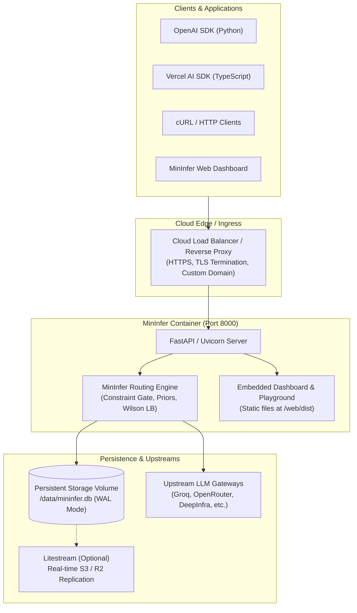

# MinInfer Cloud Deployment Guide

> **Moved.** The deployment manifests now live under [`deploy/`](deploy/README.md):
> `deploy/local/` (single container) and `deploy/cloud/` (Fly, k8s, ECS). The
> `Dockerfile` and `docker-compose.yml` remain at the repo root — the image is
> shared by both variants, and the root compose is a one-line `include:` of
> `deploy/local/docker-compose.yml`, so every command below still works.
>
> For offering MinInfer *as an API to other people* (auth, tenancy, limits,
> billing), see [`PRODUCTIZATION.md`](PRODUCTIZATION.md) instead — this guide
> covers running it for yourself.

This guide provides a production-grade blueprint for deploying MinInfer to the cloud. It covers containerization, state persistence (SQLite in the cloud), zero-downtime backups, and platform-specific deployment recipes (Fly.io, AWS, GCP, Railway, Kubernetes, and Docker Compose).

---

## 1. Architecture Overview

MinInfer combines an intelligent dynamic router, an OpenAI-compatible proxy, and an embedded developer dashboard and playground into a single, high-performance container.



### Key Architectural Characteristics
* **Single-Container Deployment**: FastAPI serves both the `/v1` routing API and the compiled React SPA from `/web/dist`.
* **Stateful SQLite Registry**: MinInfer maintains an 80MB+ SQLite database (`mininfer.db`) storing 23,000+ model deployments, benchmark priors, quota counters, and routing decisions.
* **Single-Writer Constraint**: SQLite handles high read concurrency (WAL mode) with a single writer process. Multi-replica horizontal scaling should be configured with a primary writer or paired with Litestream / Postgres sync.

---

## 2. What All Is Needed (Prerequisites Checklist)

### Compute & Sizing
* **Minimum**: 1 vCPU, 512 MB – 1 GB RAM.
* **Recommended**: 2 vCPUs, 2 GB RAM (for high-concurrency SSE streaming and low-latency Wilson score calculations).

### Storage
* **Persistent Volume**: At least 1 GB (recommended: 5 GB to accommodate decision logs and benchmark snapshots).
* **Mount Point**: `/data` (where `mininfer.db` will reside).

### Outbound Network
* Outbound HTTPS access (TCP port 443) to upstream providers:
  * `api.groq.com`
  * `openrouter.ai`
  * `api.deepinfra.com`
  * `api-inference.huggingface.co`
  * `generativelanguage.googleapis.com`

### Required Environment Variables & Secrets
| Variable | Description | Example / Default |
| :--- | :--- | :--- |
| `HOST` | Bind address | `0.0.0.0` |
| `PORT` | Container HTTP port | `8000` |
| `MI_DB` | Path to active database | `/data/mininfer.db` |
| `MI_POLICY` | Path to routing policy YAML | `/app/config/policy.yaml` |
| `LOG_LEVEL` | Uvicorn logging level | `info` |
| `OPENROUTER_API_KEY` | OpenRouter credentials | `sk-or-v1-...` |
| `GROQ_API_KEY` | Groq credentials | `gsk_...` |
| `DEEPINFRA_API_KEY` | DeepInfra credentials | `...` |
| `HF_TOKEN` | Hugging Face credentials | `hf_...` |
| `GEMINI_API_KEY` | Google Gemini API key | `AIza...` |
| `AI_GATEWAY_API_KEY`| Vercel AI Gateway key | `...` |

---

## 3. Storage Strategy: Managing SQLite in the Cloud

Because MinInfer uses SQLite for high-speed local inference ranking, your cloud architecture needs a state strategy. Choose one of the following three options:

### Strategy A: Attached Persistent Volume (Recommended)
Attach a persistent block or network volume mounted at `/data`.
* **How it works**: The container boots, checks if `/data/mininfer.db` exists, and seeds it from the container image template (`/app/seed.db`) if empty.
* **Best for**: Fly.io, Railway, Render, AWS ECS + EFS, Kubernetes PVC.

### Strategy B: Continuous Backup with Litestream (Zero Data Loss)
[Litestream](https://litestream.io/) runs as a sidecar or supervisor process inside the container, continuously streaming SQLite WAL frames to Cloudflare R2, AWS S3, or GCS.
* **How it works**: On container startup, Litestream restores the newest database snapshot from object storage in seconds. On write, changes stream immediately to S3.
* **Best for**: Ephemeral containers, Google Cloud Run, autoscaling architectures.

### Strategy C: Hybrid Postgres Sync (`mi sync`)
Maintain SQLite for local execution speed, but sync snapshots and decision ledgers to Supabase/Postgres.
* **How it works**: Configure `DATABASE_URL` or `SUPABASE_DB_URL` and run `mi sync` periodically via cron.

---

## 4. Platform Deployment Recipes

### Recipe 1: Fly.io (Fastest & Simplest Production Setup)

Fly.io provides serverless containers with dedicated NVMe storage volumes and global edge HTTPS.

#### Step 1: Install Fly CLI & Authenticate
```bash
brew install flyctl
fly auth login
```

#### Step 2: Initialize Fly Configuration
Create `fly.toml` in your project root:
```toml
app = "mininfer-router"
primary_region = "iad"

[build]
  dockerfile = "Dockerfile"

[env]
  HOST = "0.0.0.0"
  PORT = "8000"
  MI_DB = "/data/mininfer.db"
  MI_POLICY = "/app/config/policy.yaml"

[mounts]
  source = "mininfer_data"
  destination = "/data"

[http_service]
  internal_port = 8000
  force_https = true
  auto_stop_machines = false
  auto_start_machines = true
  min_machines_running = 1

  [http_service.concurrency]
    type = "requests"
    hard_limit = 200
    soft_limit = 150

[[vm]]
  size = "shared-cpu-1x"
  memory = "1gb"

[[http_service.checks]]
  grace_period = "10s"
  interval = "30s"
  method = "GET"
  path = "/healthz"
  timeout = "5s"
```

#### Step 3: Create Persistent Volume & Set Secrets
```bash
# Create a 3GB persistent NVMe volume in your region
fly volumes create mininfer_data --size 3 --region iad

# Set provider API keys
fly secrets set \
  GROQ_API_KEY="gsk_..." \
  OPENROUTER_API_KEY="sk-or-v1-..." \
  DEEPINFRA_API_KEY="..."
```

#### Step 4: Deploy
```bash
fly deploy
```
Your router and dashboard are now live with automatic SSL at `https://mininfer-router.fly.dev`.

---

### Recipe 2: Docker Compose (VPS / Linode / Hetzner / DigitalOcean)

Deploying on a standard Ubuntu/Debian server using Docker and Caddy for automated Let's Encrypt SSL.

#### Step 1: Clone & Configure `.env`
```bash
git clone https://github.com/your-org/mininfer.git
cd mininfer
cp .env.example .env
# Edit .env with your real provider keys
```

#### Step 2: Start Container Stack
```bash
docker compose up -d --build
# identical to: docker compose -f deploy/local/docker-compose.yml up -d --build
```

#### Step 3: Configure Reverse Proxy with HTTPS (Caddy)
Install Caddy and add to `/etc/caddy/Caddyfile`:
```caddyfile
router.yourdomain.com {
    reverse_proxy 127.0.0.1:8000 {
        # Support Server-Sent Events (SSE) streaming without buffering
        flush_interval -1
    }
}
```
Reload Caddy: `sudo systemctl reload caddy`.

---

### Recipe 3: AWS ECS Fargate + EFS (Enterprise Cloud)

For AWS production deployments requiring SOC2/ISO compliance:

1. **Storage**: Create an Amazon EFS (Elastic File System) filesystem in your VPC.
2. **Access Point**: Create an EFS Access Point with POSIX UID/GID `1001:1001` and path `/mininfer`.
3. **Task Definition**:
   - Volume: Attach the EFS volume.
   - Container Mount: Mount EFS to `/data`.
   - Port: `8000`.
   - Secrets: Pull API keys from AWS Secrets Manager via container environment valueFrom.
4. **Load Balancer**: Application Load Balancer (ALB) terminating HTTPS on port 443 with an ACM certificate, forwarding to target group port 8000.
5. **Health Check**: Path `/healthz`, matcher `200`.

---

### Recipe 4: Kubernetes / K3s Manifest

> **This is the single-replica SQLite shape, kept for a self-host on one node.**
> For the multi-replica cloud shape — registry on Postgres, limits and caches on
> Redis, a worker CronJob, and the CA-bundle mount — use the maintained manifest
> at `deploy/cloud/k8s.yaml` (`CLOUD_ACTIVITY.md` Phase 1.0). Do not add a second
> divergent manifest here.

Apply the following manifest (`mininfer-k8s.yaml`) to your cluster:

```yaml
apiVersion: v1
kind: PersistentVolumeClaim
metadata:
  name: mininfer-pvc
  namespace: default
spec:
  accessModes:
    - ReadWriteOnce
  resources:
    requests:
      storage: 5Gi
---
apiVersion: apps/v1
kind: Deployment
metadata:
  name: mininfer
  namespace: default
  labels:
    app: mininfer
spec:
  replicas: 1 # SQLite is single-writer; see deploy/cloud/k8s.yaml for Postgres
  strategy:
    type: Recreate
  selector:
    matchLabels:
      app: mininfer
  template:
    metadata:
      labels:
        app: mininfer
    spec:
      containers:
        - name: mininfer
          image: mininfer:latest
          imagePullPolicy: IfNotPresent
          ports:
            - containerPort: 8000
          env:
            - name: HOST
              value: "0.0.0.0"
            - name: PORT
              value: "8000"
            - name: MI_DB
              value: "/data/mininfer.db"
            - name: OPENROUTER_API_KEY
              valueFrom:
                secretKeyRef:
                  name: mininfer-secrets
                  key: openrouter-key
                  optional: true
            - name: GROQ_API_KEY
              valueFrom:
                secretKeyRef:
                  name: mininfer-secrets
                  key: groq-key
                  optional: true
          volumeMounts:
            - name: data-volume
              mountPath: /data
          livenessProbe:
            httpGet:
              path: /healthz
              port: 8000
            initialDelaySeconds: 10
            periodSeconds: 30
          readinessProbe:
            httpGet:
              path: /healthz
              port: 8000
            initialDelaySeconds: 5
            periodSeconds: 10
          resources:
            requests:
              cpu: "250m"
              memory: "512Mi"
            limits:
              cpu: "1000m"
              memory: "1536Mi"
      volumes:
        - name: data-volume
          persistentVolumeClaim:
            claimName: mininfer-pvc
---
apiVersion: v1
kind: Service
metadata:
  name: mininfer-svc
  namespace: default
spec:
  selector:
    app: mininfer
  ports:
    - port: 80
      targetPort: 8000
  type: ClusterIP
---
apiVersion: networking.k8s.io/v1
kind: Ingress
metadata:
  name: mininfer-ingress
  namespace: default
  annotations:
    cert-manager.io/cluster-issuer: "letsencrypt-prod"
    nginx.ingress.kubernetes.io/proxy-buffering: "off" # Critical for streaming SSE
    nginx.ingress.kubernetes.io/proxy-read-timeout: "300"
spec:
  ingressClassName: nginx
  tls:
    - hosts:
        - router.example.com
      secretName: mininfer-tls
  rules:
    - host: router.example.com
      http:
        paths:
          - path: /
            pathType: Prefix
            backend:
              service:
                name: mininfer-svc
                port:
                  number: 80
```

---

## 5. Security & Access Control

### 1. Reverse Proxy Authentication (Protecting Public Endpoints)
If you deploy MinInfer to a public URL and want to restrict who can send prompts or view the telemetry dashboard:
* **Option A: HTTP Basic Auth or Cloudflare Access**: Place Cloudflare Zero Trust or Nginx basic auth in front of the web dashboard.
* **Option B: API Key Header Validation**: Use an API Gateway (Kong, Envoy, AWS API Gateway) to validate an `X-API-Key` or `Authorization: Bearer <key>` header before proxying to MinInfer.

### 2. Session Budget Caps
MinInfer natively enforces session-level spend limits. You can pass session IDs from your client:
```python
client = OpenAI(
    base_url="https://router.example.com/v1",
    api_key="none",
    default_headers={"X-MI-Session": "tenant-user-123"}
)
```
In `config/policy.yaml`, configure `session_budget_usd` to prevent rogue loops or excessive billing.

### 3. Non-Root Execution
The provided `Dockerfile` creates a dedicated system user (`mininfer`, UID `1001`) with restricted permissions and no sudo access.

---

## 6. Zero-Downtime Backup with Litestream

For mission-critical production instances where you do not want to rely solely on cloud disk snapshots, attach Litestream to stream WAL frames to object storage:

```yaml
# litestream.yml
dbs:
  - path: /data/mininfer.db
    replicas:
      - type: s3
        bucket: my-mininfer-backups
        path: mininfer.db
        endpoint: https://<account-id>.r2.cloudflarestorage.com
        access-key-id: ${LITESTREAM_ACCESS_KEY_ID}
        secret-access-key: ${LITESTREAM_SECRET_ACCESS_KEY}
```

Restore happens automatically on boot:
```bash
litestream restore -if-replica-exists /data/mininfer.db
litestream replicate -exec "uvicorn mininfer.proxy:app --host 0.0.0.0 --port 8000"
```

---

## 7. Day-2 Operations & Maintenance

### 1. Health Checks
The proxy exposes an instantaneous health check endpoint:
```bash
curl -f https://router.example.com/healthz
# Returns: {"status": "ok"} (HTTP 200)
```

### 2. Automated Catalog Updates
Model availability, pricing, and leaderboards evolve continuously. Set up a daily cron job or GitHub Actions workflow to refresh the catalog:
```bash
# Ingest newest model catalogs from OpenRouter, Groq, DeepInfra
mi ingest --source auto

# Pull latest Artificial Analysis & LMSYS benchmark metrics
mi metrics --source vercel

# Re-benchmark latency
mi bench --all
```

---

## Summary Deployment Command Quick Reference

```bash
# Local container build test
docker build -t mininfer:latest .

# Run locally with Docker
docker run -d \
  --name mininfer \
  -p 8000:8000 \
  -v mininfer_data:/data \
  -e GROQ_API_KEY="your-key" \
  mininfer:latest

# Verify health
curl http://127.0.0.1:8000/healthz

# Test OpenAI-compatible completion
curl http://127.0.0.1:8000/v1/chat/completions \
  -H "Content-Type: application/json" \
  -d '{"model":"auto","messages":[{"role":"user","content":"Hello MinInfer!"}]}'
```
